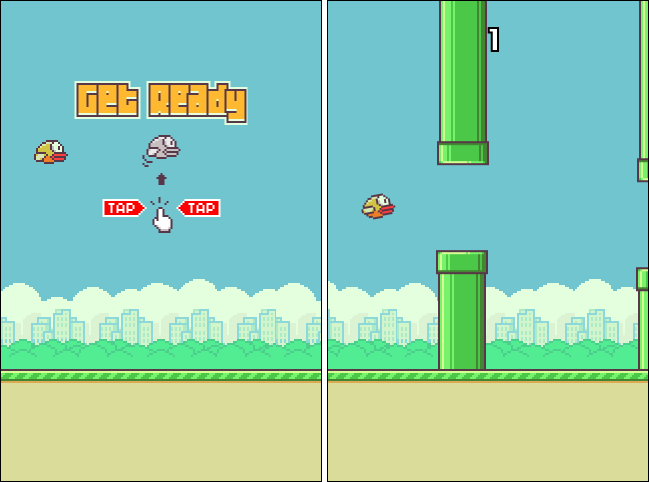

# Flappy Bird JS

A Flappy Bird game clone written in JavaScript. Reworked code from [this](https://www.youtube.com/watch?v=0ArCFchlTq4) tutorial with minor modifications. See the original code [here](https://github.com/CodeExplainedRepo/Original-Flappy-bird-JavaScript).



## How to Run

1. Clone or download the repo

2. Simply open the `index.html` file

3. OR if you want to build the game yourself, run these commands:

```
npm install
npm run prod
```

The code uses webpack (via laravel-mix) as a build system.